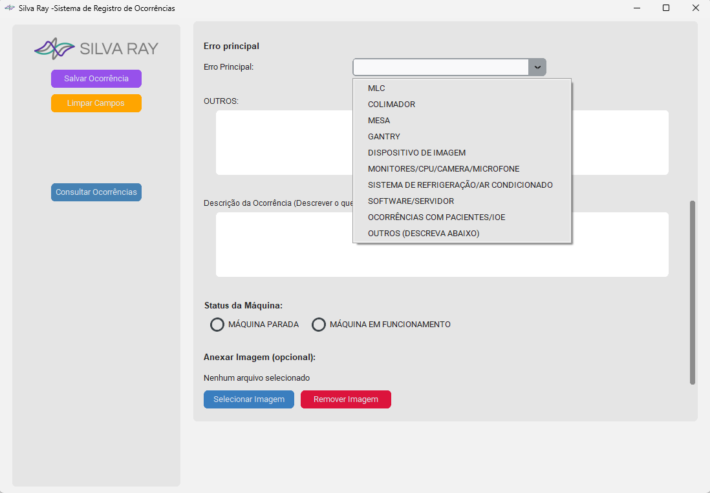

# Sistema de Registro de Ocorrências - Silva Ray

Este é um sistema local desenvolvido pela **Silva Ray** para o registro de ocorrências técnicas e operacionais em ambientes clínicos e hospitalares. O software permite registrar, visualizar e consultar incidentes de forma estruturada, incluindo anexos de imagens, descrição do evento, e parâmetros técnicos.

---


---
## ⚠️ Aviso Legal

> **A Silva Ray não se responsabiliza por qualquer uso indevido ou consequências da utilização deste software.**
>
> O software é fornecido **"como está"**, sem garantias de qualquer natureza. O uso é de **inteira responsabilidade do usuário**.

---

## 🖥️ Como usar

### 1. Download

Baixe o sistema clicando no botão abaixo:

> [**BAIXAR SISTEMA**](https://github.com/Silva-Ray-Dev/OcorrenciaRay/OcorrenciaRay.zip)

Ou clone via Git:

```bash
git clone https://github.com/Silva-Ray-Dev/OcorrenciaRay.git


---

### 2. Estrutura de Pastas

Após extrair o conteúdo, mantenha **todas as pastas intactas**:


---

### 3. Executar o sistema

Não é necessário instalar. Basta dar **duplo clique em `OcorrenciaRay.exe`** dentro da pasta principal.

- O sistema será aberto automaticamente.
- Você poderá preencher todos os campos, anexar imagens e salvar ocorrências.
- As ocorrências ficam salvas localmente em `REGISTROS/ocorrencias.json`.

---


## 🛠 Requisitos

- Sistema Operacional testado: **Windows 10 (64 bits)**
- Não é necessário instalar: **executável portátil**


## ✅ Funcionalidades

- Registro completo de parâmetros técnicos (gantry, colimadores, mesa etc.)
- Campos de texto e seleção para descrição e status da máquina
- Anexo de imagem opcional
- Consulta das ocorrências com pré-visualização de imagem
- Exportação e registro local em JSON

---

##  Contatos❓

Para dúvidas ou sugestões, entre em contato com a equipe da **Silva Ray**:

- Site: [www.silvaraysoftware.com.br](https://www.silvaraysoftware.com.br)


---

**Desenvolvido por Silva Ray Software LTDA**  
Todos os direitos reservados.
